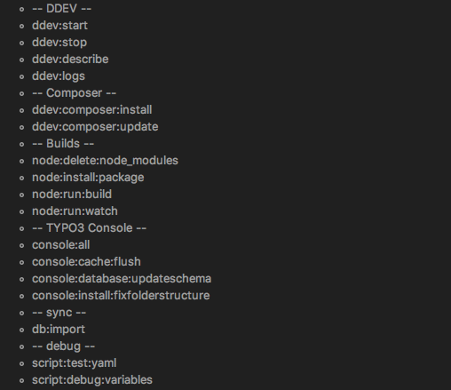

# DDEV Tools for typo3

> ddevtools is a little toolbox that allows you to use npm scripts to run commands in your ddev environment. If you use phpstorm you could just rightclick on `.vendor/analogde/ddevtools/package.json` to list the npm scripts of ddevtools like shown on the screenshot. 



## .ddevtools.yaml

> If you have no .ddevtools.yaml in your project root just run `npm run script script:test:yaml` or click the task. Now the .ddevtools.yaml should be generated. 

```
init: **not used at the moment**

provider:
  name: **name of your provider extension**
  package_json: **path to your package.json file where you have your build tasks**
  custom_build: **optional if you want to use a custom build task**
  custom_watch: **optional if you want to use a custom watch task**
```

Here you could find an example of an provider extension with builds: [startpilot](https://github.com/Startpiloten/startpilot/blob/develop/Resources/Build/package.json)

## !! Actual this project is just a proof of concept !!
